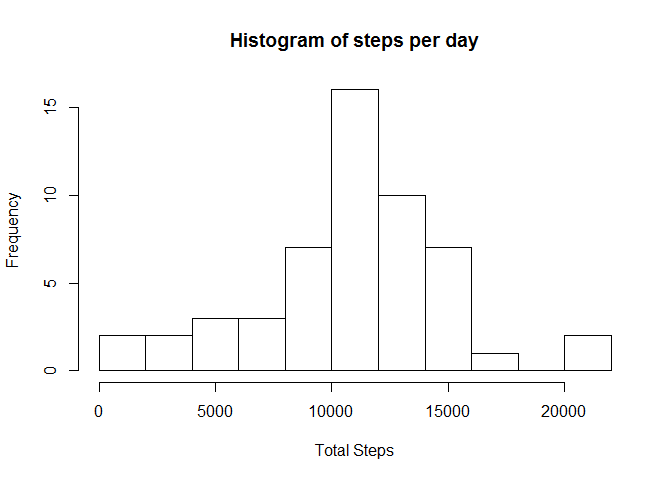
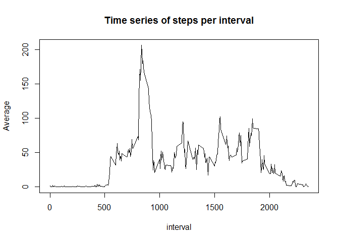
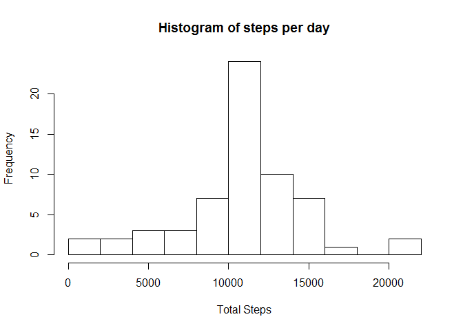
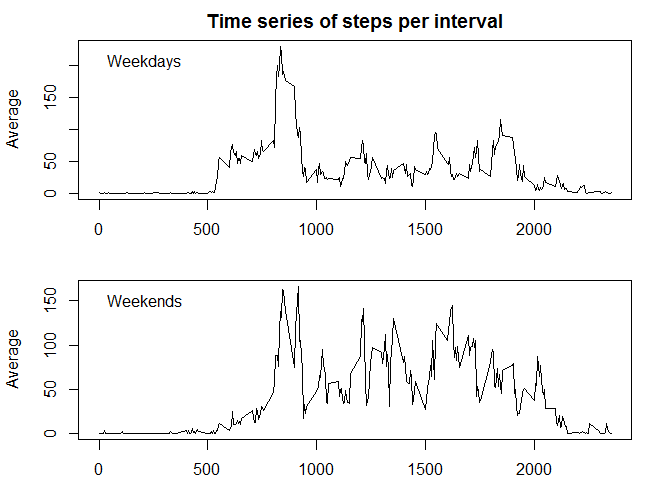

# Reproducible Research: Peer Assessment 1
Sanne Aalbers  


## Loading and preprocessing the data
Make sure the working directory is set correctly before loading the data and/or the data is stored into the correct folder.


```r
activity_data = read.csv("activity.csv", colClasses = c(date = "Date"))
```

## What is mean total number of steps taken per day?
We will use the `plyr` package to calculate the total number of steps per day.


```r
library(plyr)
totalsteps =  ddply(activity_data,.(date), summarize, Total = sum(steps))
```

Now we can make a simple histogram of the total number of steps per day.


```r
hist(totalsteps$Total, breaks = 10, xlab = "Total Steps", main = "Histogram of steps per day")
```

 

Calculate the mean and median of the total number of steps per day:


```r
mean(totalsteps$Total, na.rm = T)
```

```
## [1] 10766.19
```

```r
median(totalsteps$Total, na.rm = T)
```

```
## [1] 10765
```

## What is the average daily activity pattern?
Calculate the average number of steps taken (across all days) for each of the 5-minute intervals:


```r
averagesteps = ddply(activity_data, .(interval), summarize, Average = mean(steps, na.rm=T))
```

Now we make a time series of the results:

```r
plot(averagesteps, type = "l", main = "Time series of steps per interval")
```

 

The interval that contains the maximum number of steps (on average across al days):

```r
averagesteps$interval[which.max(averagesteps$Average)]
```

```
## [1] 835
```

## Imputing missing values
The total number of rows with missing values is:

```r
sum(is.na(activity_data$steps))
```

```
## [1] 2304
```
Note that this calculation only works in this situation since the other two columns do not have `NA` values.

We will substitute the `NA` values with the average of its corresponding 5-minute interval. The averages are already calculated and stored into the variable `averagesteps`. We will use the match function to obtain the average corresponding to the 5-minute interval.


```r
new_data = activity_data
ind = is.na(new_data$steps)
new_data[ind,1] = averagesteps[match(new_data[ind,]$interval, averagesteps$interval),2]
```

With this new dataset we plot a histogram and calculate the mean and median:

```r
totalstepsnew =  ddply(new_data,.(date), summarize, Total = sum(steps))
hist(totalstepsnew$Total, breaks = 10, xlab = "Total Steps", main = "Histogram of steps per day")
```

 

Calculate the mean and median of the total number of steps per day:


```r
mean(totalstepsnew$Total)
```

```
## [1] 10766.19
```

```r
median(totalstepsnew$Total)
```

```
## [1] 10766.19
```

As expected, the mean is exactly the same (since we replaced values with the average). The median is somewhat higher and equal to the mean.

  
## Are there differences in activity patterns between weekdays and weekends?
First, we add a new column to the dataset that contains the name of the day and transform is to either the value 'weekend' or 'weekday':

```r
new_data = cbind(new_data, "day" = weekdays(new_data$date))
new_data$day <- ifelse((new_data$day == "zaterdag") | (new_data$day == "zondag"), "Weekend", "Weekday")
```

Now we can calculate the average and plot the results.

```r
averagestepsnew = ddply(new_data, .(interval, day), summarize, Average = mean(steps, na.rm=T))
```

Now we make a time series of the results:

```r
par(mfrow=c(2,1), mar=c(2, 4, 2, 2) + 0.1)
plot(subset(averagestepsnew,day == "Weekday")[,c(1,3)], type = "l", main = "Time series of steps per interval")
legend("topleft", "Weekdays", bty = "n")
plot(subset(averagestepsnew,day == "Weekend")[,c(1,3)], type = "l")
legend("topleft", "Weekends", bty = "n")
```

 

You can see a difference between the average number of steps taken per interval in weekends and on weekdays. The number of steps in weekends seems somewhat constant between the 5-minute intervals from approximately the 800th to 2000th interval. On the other hand, on weekdays you can see a clear peak around the 800th 5-minute interval.
